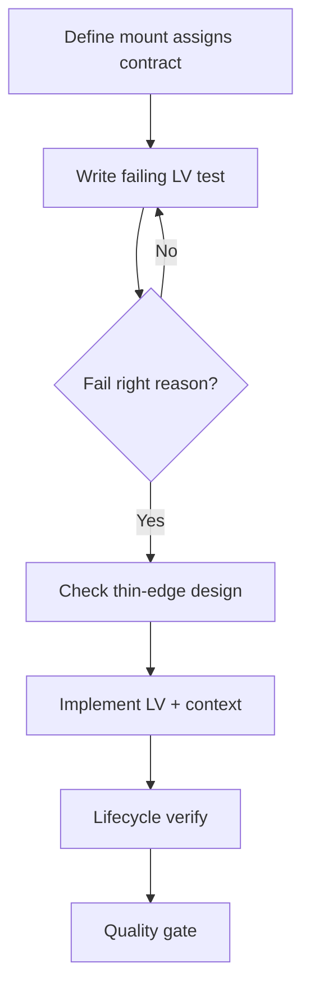

Resolve skill names through `../../skill-map.json`; use the source pack to disambiguate. Load only the workflow and resources needed for the authorized task.

# LiveView Playbook

## HARD-GATE

- A LiveView contract and failing `live/2` or `live_isolated` test must exist before implementation.
- The test must fail because behaviour is missing, not due to config/syntax.
- `handle_event/3` and `handle_info/2` remain thin; no `Repo` calls inside LiveViews.
- Implementation must fit authorized scope; full suite and Credo/format must pass.

## When to use

New LiveView pages/features or substantial LiveView behaviour changes.

## Atomic skills this playbook loads

| Skill | Path | Role |
|-------|------|------|
| `phoenix-liveview-essentials` | `skills/phoenix-liveview-essentials/` | Lifecycle, assigns |
| `apply-phoenix-liveview-conventions` | `skills/apply-phoenix-liveview-conventions/` | Conventions |
| `testing-essentials` | `skills/testing-essentials/` | LV tests |
| `elixir-essentials` | `skills/elixir-essentials/` | FCIS thin edges |
| `liveview-streams` | `skills/liveview-streams/` | Large collections |

## Flow



## Agent Phases

### Phase 1 — Contract

Document assigns shape, events, and which work lives in **context/pure modules** vs LiveView.

**HARD GATE — LiveView contract:**

- [ ] Assigns shape and lifecycle events are documented.
- [ ] A failing `live/2` or `live_isolated` test exists before implementation.
- [ ] Work is split between LiveView (render/events) and context/pure modules (domain/Repo).

**If gate fails:** Refine the contract and write the failing test before writing any implementation code.

### Phase 2 — RED

Write `live/2` or `live_isolated` test; run until fail is “missing behaviour”.

**HARD GATE — Test fails for right reason:**

- [ ] The test fails because behaviour is missing, not due to config/syntax errors.

**If gate fails:** Fix the test setup or expectations; do not write implementation to make a wrongly-failing test pass.

### Phase 3 — Implementation

1. Propose thin `handle_event` → context design (no Repo in LiveView).
2. Verify that the design fits the authorized task, then implement. Ask only for a material scope decision or unauthorized external action.
3. Implement; keep callbacks thin (FCIS).

**HARD GATE — Thin handle_event and handle_info:**

- [ ] `handle_event/3` and `handle_info/2` call context functions; no `Repo` or heavy business logic in LiveView.
- [ ] Implementation design matches the authorized task.

**If gate fails:** Extract logic into context or pure functions; verify the revised design stays within scope.

### Phase 4 — Verify

- Mount → render → event → update path green
- `connected?` for side effects; streams for large lists

**HARD GATE — Lifecycle green:**

- [ ] Mount → render → event → update path is green.
- [ ] Side effects are guarded by `connected?(socket)`.
- [ ] Streams are used for large collections.

**If gate fails:** Extract heavy logic from callbacks; re-test the lifecycle path.

### Phase 5 — Quality

`mix test`, format, credo; no assigns bloat.

**HARD GATE — Authorized scope and green suite:**

- [ ] Implementation matches the authorized acceptance criteria.
- [ ] `mix test`, `mix format --check-formatted`, and `mix credo --strict` pass.
- [ ] No unnecessary assigns bloat.

**If gate fails:** Refactor, remove bloat, and re-run the full quality gate.

## Verification checklist

- [ ] Contract written
- [ ] Failing test first
- [ ] Implementation matches authorized scope
- [ ] No Repo/business soup in LiveView
- [ ] Tests green

## Error Recovery

Fat LiveView after impl → extract pure/context module; re-test.

## Output Style

```markdown
## LiveView Feature Report

**Contract:** <assigns/events and where work lives>
**Test command:** `<test command>`
**HARD-GATE results:**
- LiveView contract: PASS / FAIL
- Test fails for right reason: PASS / FAIL
- Thin handle_event and handle_info: PASS / FAIL
- Authorized scope and green suite: PASS / FAIL
**Lifecycle notes:** <mount/render/event/update path, connected? side effects, streams>
**Verdict:** APPROVE / REQUEST_CHANGES
```
