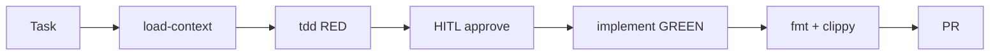
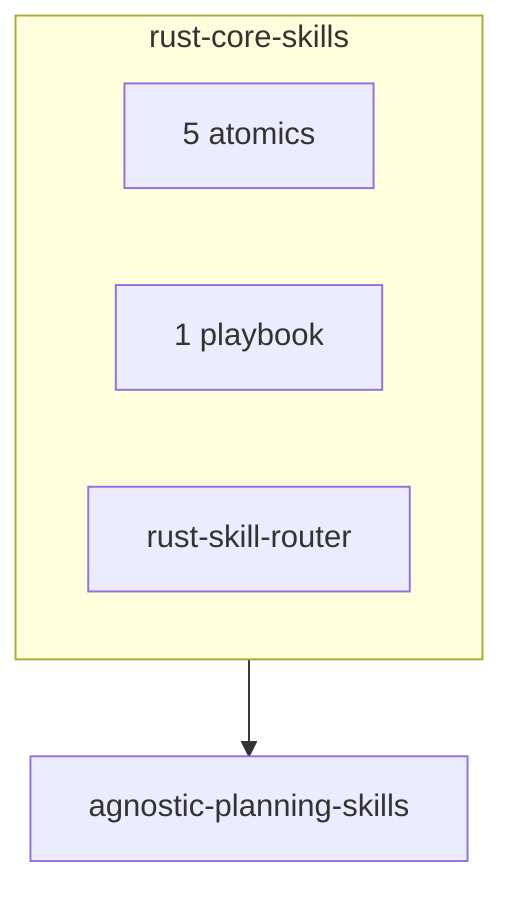

# Rust Core Skills

7 written skills for idiomatic Rust: FCIS, ownership, type-driven design, cargo TDD. Complements [`agnostic-planning-skills`](https://github.com/igmarin/agnostic-planning-skills) for PRDs. Does **not** depend on `ruby-core-skills`.

```text
Write the test → run cargo test → confirm it fails for the right reason → implement → confirm it passes
```





Also in the same ecosystem: [`ruby-core-skills`](https://github.com/igmarin/ruby-core-skills), [`rails-agent-skills`](https://github.com/igmarin/rails-agent-skills), [`elixir-phoenix-skills`](https://github.com/igmarin/elixir-phoenix-skills), [`agent-mcp-runtime`](https://github.com/igmarin/agent-mcp-runtime).

Name the router when the next skill is unclear: `rust-skill-router`. Name `tdd` when behaviour changes. Canonical FP: [`docs/fcis-rust.md`](docs/fcis-rust.md).

## Catalog

| Area | Skills |
|------|--------|
| Rust core | `rust-essentials`, `ownership-borrowing`, `type-driven-design`, `error-handling` |
| Project | `load-context` |
| Playbooks | `tdd` |
| Orchestration | `rust-skill-router` |

`directory.json` lists **written** skills only. Planned names: [`docs/topic-inventory.md`](docs/topic-inventory.md). Full list: [`docs/reference/skill-catalog.md`](docs/reference/skill-catalog.md).

On an existing crate, start with `load-context`, then `tdd` or `rust-essentials`.

## Install

There is **no** root `SKILL.md`. Each folder under `skills/` is its own skill, so the CLI can prompt for **all** or **one**.

```bash
# picker: all skills, or a subset
npx skills add igmarin/agnostic-planning-skills
npx skills add igmarin/rust-core-skills

# all skills, skip prompts
npx skills add igmarin/rust-core-skills --skill '*'

# one skill
npx skills add igmarin/rust-core-skills --skill rust-essentials
```

Or with GitHub CLI v2.90.0+ (`gh skill`):

```bash
gh skill install igmarin/rust-core-skills
gh skill install igmarin/rust-core-skills rust-essentials --scope project
```

Repo page: [skills.sh/igmarin/rust-core-skills](https://skills.sh/igmarin/rust-core-skills). Groupings: [`skills.sh.json`](skills.sh.json) (display only).

## Docs

| Need | Document |
|------|----------|
| Host context | [AGENTS.md](AGENTS.md) |
| Browse all skills | [docs/reference/skill-catalog.md](docs/reference/skill-catalog.md) |
| Skill layout | [docs/architecture.md](docs/architecture.md) |
| FCIS | [docs/fcis-rust.md](docs/fcis-rust.md) |
| Playbooks | [docs/playbooks.md](docs/playbooks.md) |
| Planned skills | [docs/topic-inventory.md](docs/topic-inventory.md) |

## Contributing

- Artifacts in English unless the user asks otherwise.
- Keep the tests-gate rule on every code-producing skill.
- `description` is when + triggers (≤ 600 chars). Procedure stays in the body.
- Keep public docs in sync with `directory.json`.
- Flat layout only: `skills/<name>/SKILL.md`. No root `SKILL.md`.

## License

MIT. See [LICENSE](LICENSE).

## Agent composition and compatibility

Use [the execution contract](docs/agent-contract.md) when applying these skills. If desired, developer roles and host exports can be composed in `igmarin/agent-profiles`; this repository remains authoritative for the skill text and resources. Existing names and paths remain valid. Root `AGENTS.md` is for contributors, not an installed developer role.
